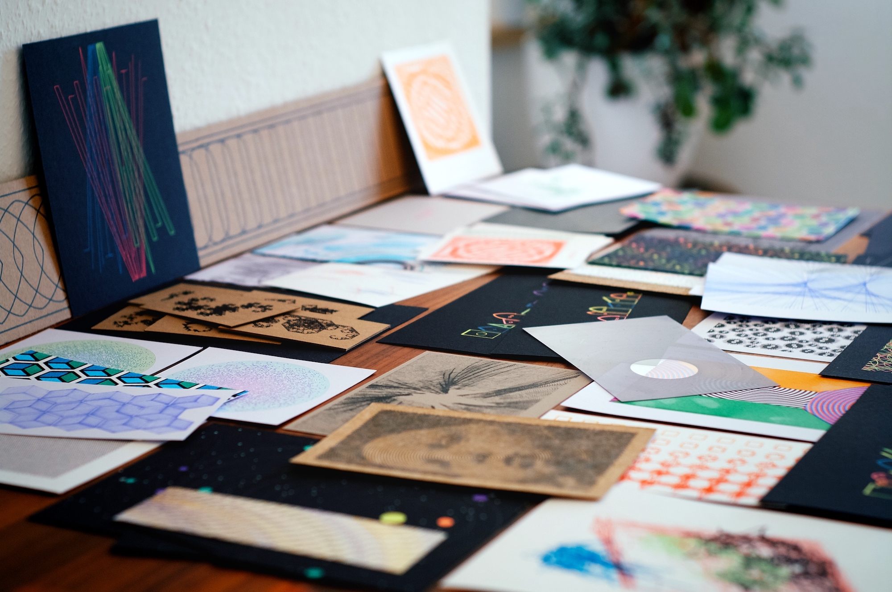

# #GENUARY2022

This repository contains the code and/or SVG files underlying the plotter drawings I made for [#GENUARY2022](https://twitter.com/hashtag/GENUARY2022). It also contains the tweeted texts, images, and videos; `notes.txt` contains my ideas and notes.

[Click here to view the Twitter thread.](https://twitter.com/doersino/status/1477304986077962249)

All of this is **not optimized, documented, or made elegant in any way** (nor, in some cases, is it reproducible without additional information) – it's the generative art equivalent of a painter tossing their still-paint-laden-brushes and torn-up-sketches into a drawer after each painting.

| Day (Link to subfolder) | Prompt (From [genuary.art](http://genuary.art)) | Description | Tools |
|---|---|---|---|
| [01](day01/) | Draw 10,000 of something. | Plotted a jagged line of 10000 segments representing the first 10000 numbers, with primes plotted using red pen. | JavaScript & Inkscape |
| [02](day02/) | Dithering. | Used concentric spirals with ever-increasing gaps to dither radial gradients. | JavaScript |
| [03](day03/) | Space. | Tiny solar system generator. | JavaScript |
| [04](day04/) | The next next Fidenza. | A typical [UJI](https://doersino.github.io/uji/) drawing. | UJI |
| [05](day05/) | Destroy a square. | Not much time on this day – so just a grid of ever-more-distorted squares. | JavaScript |
| [06](day06/) | Trade styles with a friend. | Imitated [@KennoM](https://twitter.com/KennoM)'s style of heavily processing [UJI](https://doersino.github.io/uji/) drawings using [Drawing Bot V3](https://github.com/SonarSonic/DrawingBotV3). | UJI & Drawing Bot V3 |
| [07](day07/) | Sol LeWitt Wall Drawing. | Started out intending to draw a reproduction of [Wall Drawing #462](https://massmoca.org/event/walldrawing462/), ended up going down a slightly different path. | JavaScript |
| [08](day08/) | Single curve only. | Took a Heighway dragon curve, fiddled with the maths. | JavaScript |
| [09](day09/) | Architecture. | Bird nest box generator. | JavaScript |
| [10](day10/) | Machine learning, wrong answers only. | *skipped* |  |
| [11](day11/) | No computer. | Went spelunking in my "leftover bits and bobs from IKEA furniture" drawer, found a screw, a washer, and something that sorta works as a nut, then clamped some paper in-between and attached the whole shebang to my drill, powered it up and held some pens in the general direction of the spinning paper. | Drill |
| [12](day12/) | Packing (squares, circles, any shape...). | A whole bunch of susuwatari. | JavaScript |
| [13](day13/) | 80x800. | Went for centimeters, not pixels – using special registration marks, plotted an "evolution" of squircles on corrugated cardboard. | JavaScript |
| [14](day14/) | Something you'd never make. | "an nft" | Inkscape |
| [15](day15/) | Sand. | Plotted, using a piece of wood in place of a pen, a simple wavy pattern on *sand*paper. | UJI |
| [16](day16/) | Color gradients gone wrong. | Abstract figures. | JavaScript |
| [17](day17/) | 3 colors. | Progressively more-complete circles, squares, and triangles spirallying away from the middle. | UJI |
| [18](day18/) | VHS. | Drawings of VHS tapes with randomly-tangled tape having been pulled out. | JavaScript |
| [19](day19/) | Use text/typography. | AAAAAAAAAAAAAAAAAAAAAAAAAAAAAAAA. | JavaScript |
| [20](day20/) | Make a sea of shapes. | Colorful fish tessellations, loosely based on [prior art](https://society6.com/product/fish-tessellation_cutting-board). | JavaScript |
| [21](day21/) | Combine two (or more) of your pieces from previous days to make a new piece. | Really just another take on typography – rotating grids of symbols based on *x* and *y* position with a caption listing the symbols used. | JavaScript |
| [22](day22/) | Make something that will look completely different in a year. | Utilizing a steak thermometer to scratch a spiral into the surface of a bar of *Ritter Sport* chocolate, which has since been eaten. I wonder if a chocolate record could be manufactured this way? Alas, I lack playback equipment, so there's no strong impulse towards exploring this. | JavaScript |
| [23](day23/) | Abstract vegetation. | L-systems looking like shrubs, plotted using a green pen. | Observable & Inkscape |
| [24](day24/) | Create your own pseudo-random number generator and visually check the results. | Using sines and bitwise OR to generate interesting patterns – a simpler version of the PRNG used in the JavaScript framework built up throughout the month. | JavaScript |
| [25](day25/) | Perspective. | Elongated and distorted letters that spell out "PERSPECTIVE" when viewing the paper from an acute angle (a certain *perspective*) and otherwise look like an abstract take on two-point perspective. | Inkscape |
| [26](day26/) | Airport carpet. | *skipped* |
| [27](day27/) | #2E294E #541388 #F1E9DA #FFD400 #D90368. | An UJI drawing on cream (roughly #F1E9DA) paper using pens approximating the other four colors. | UJI & Inkscape |
| [28](day28/) | Self portrait. | Yours truly as a one-and-a-half-year-old, but dithered using Drawing Bot V3, with the result taking the shape of a spiral. | Pixelmator Pro & Drawing Bot V3 |
| [29](day29/) | Isometric perspective. | Isometric cubes, their faces filled using arcs. One of my favorites this month. | JavaScript |
| [30](day30/) | Organic looking output using only rectangular shapes. | Moirè. | JavaScript |
| [31](day31/) | Negative space. | Drew a partially opaque spiral on an acetate sheet, with the center left transparent. | JavaScript |

---

You may use this repository's contents under the terms of the bespoke *It's the MIT License Except You're Not Allowed to Make an NFT Unless You Use the Proceeds to Feed Birds & Send Me Pictures of Them* license, see `LICENSE`.

(Note that `day{19,21}/ReliefSingleLine-Regular.{svg,zip}` are exempt from this, they were created by The Relief SingleLine Project Authors and are licensed under the *SIL Open Font License, Version 1.1*, see [here](https://github.com/isdat-type/Relief-SingleLine/blob/main/OFL.txt). Similarly, `day23/l-systems-2.tgz` is an offline copy of [this](https://observablehq.com/@kelleyvanevert/l-systems-2) Observable notebook by Kelley van Evert, the license doesn't apply to this archive's contents either. Finally, you're not allowed to turn the `day28/` drawing of me as a baby into an NFT no matter how many birds you feed.)
